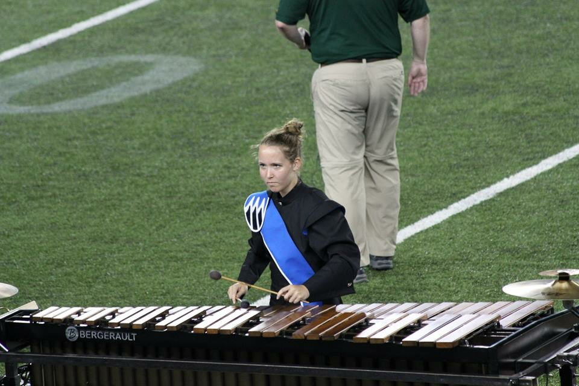

# About Me

## Bio

As of May 2018, I hold a B.S. in Computer Science from the University of Minnesota Twin-Cities and have
a M.S. in Geographic Information Science in progress. During my undergrad, I worked at St. Jude Medical and Abbott Laboratories
as a Computer Engineering intern. I decided to pursue the GIS track for computer science and found my passion in the process.

I am an effective communicator who enjoys working collaboratively. My good work ethic, love of learning, and computer science background all give me an advantage in the GIS field and make me a great addition to any team.

## Computer Science + GIS

As a former computer science student and a current MGIS student, I am interested in how
the two subjects can combine to result in efficient and effective workflows.

## Current Work

I am now a GIS Student Worker for the Minnesota Geospatial Information Office (MnGeo) and a Research Assistant in the
Borchert Map Library. Both positions involve working with metadata and GIS portals, and my work with MnGeo includes documentation, dataset editing, and providing assistance with a wide variety of projects.

## Professional Development

In October 2018, I attended the GIS/LIS Conference in Duluth and met lots of wonderful people through networking
events there, as well as learned a lot about GIS in Minnesota. I also attended the UMN Spatial forum on November 14th, 2018, and Minnesota GIS Day on November 15th 2018. I presented at Minnesota GIS Day as part of a student panel. I am currently a member of the UMN GISSO (GIS Student Organization) and the Spatial Computing group.

In the future, I aim to become a certified GISP and work in the public sector. My work for MnGeo thus far has been very rewarding
, so I would like to continue working at the state. Private sector work is not ruled out though; I am open to all avenues.

## Interests

In my free time, I enjoy performing with Minnesota Brass Indoor during the winter and Minnesota Brass Drum and Bugle
Corps in the summer. When I'm not playing percussion with those groups, you can find me reading, hiking, biking, or spending
time on the beautiful North Shore of Minnesota.

