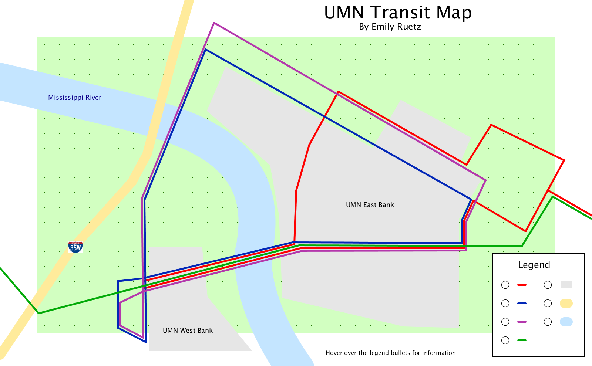
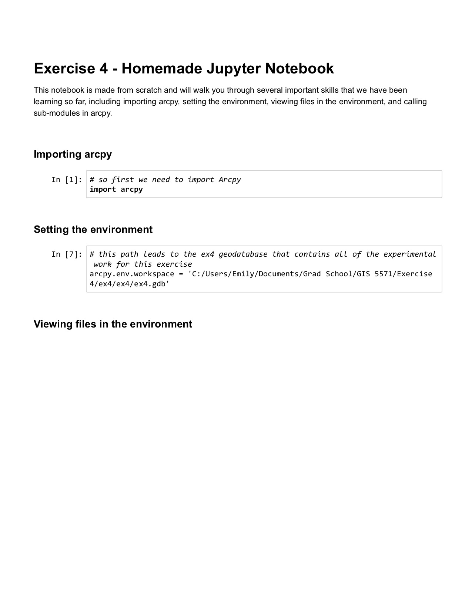
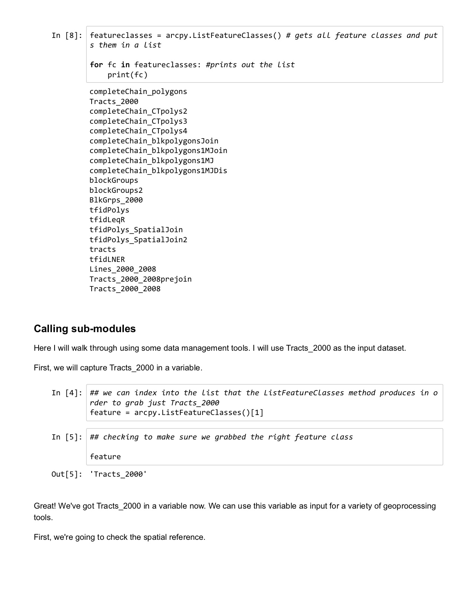
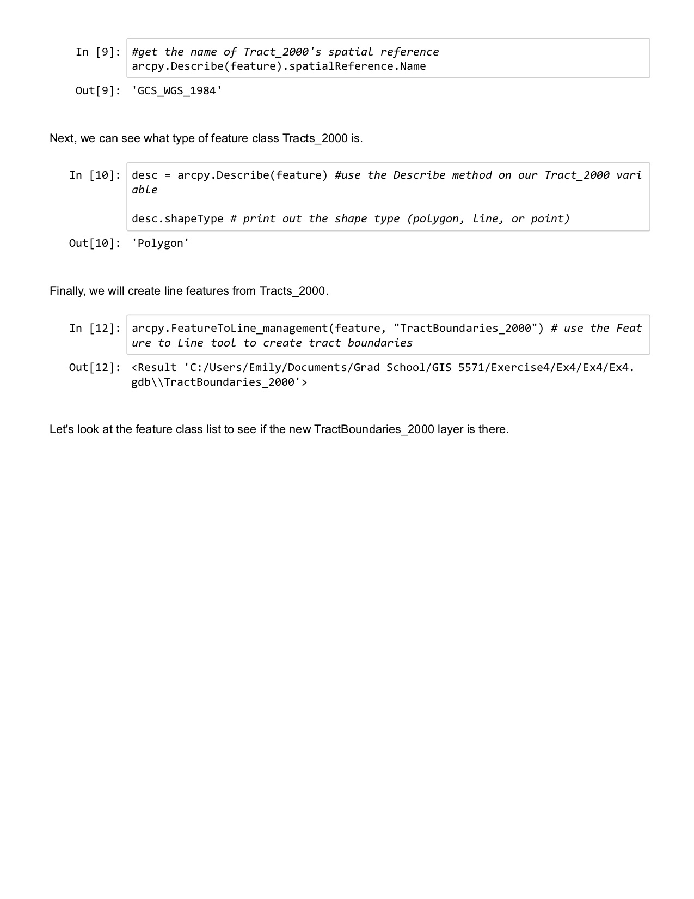
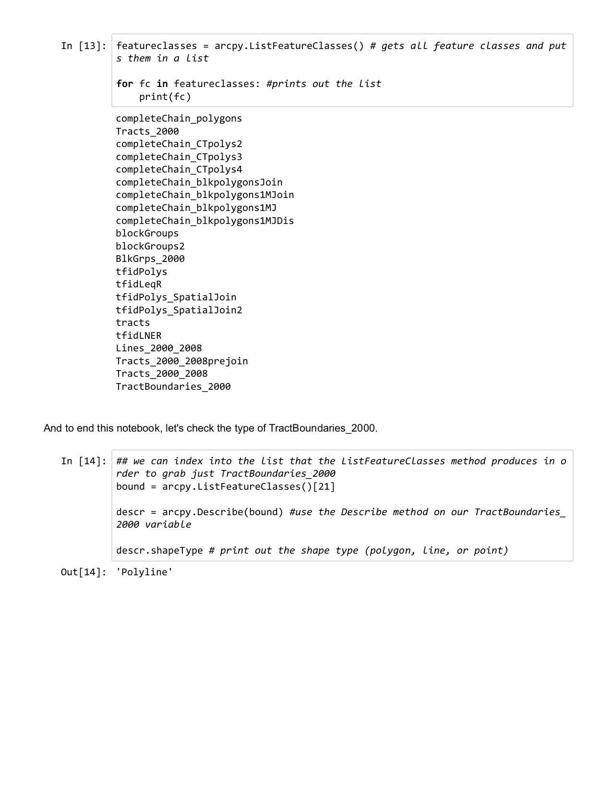

# Work Examples

## UMN Transit Map

I produced this map as a part of my Geovisualization class this semester. The legend was designed to be
interactive, so the user could hover their cursor over the circle and information about each route/legend item would pop up. This map was made using Processing, an open-source graphical library and IDE.

Skills:
  * Cartographic principles
  * Map abstraction
  * Java

## Geospatial Commons

My work for MnGeo includes updating datasets on the Minnesota Geospatial Commons. These are a few examples of datasets that I have worked with; I am listed as the metadata contact for these and other datasets.

[Family and Child Care Centers](https://gisdata.mn.gov/dataset/econ-child-care)  

[FCC Geospatial Data](https://gisdata.mn.gov/dataset/util-fcc)

## Undergraduate Honors Thesis

As a part of my computer science degree, I did research and wrote an honors thesis. I developed an algorithm that gathered farmfields found in OpenStreetMap and exported them to a shapefile, and then ran a clustering analysis on the shapefile to discover how the location of farmfields are related to urban areas.

[Undergraduate Honors Thesis](https://drive.google.com/open?id=0Bze03axEfDPfNU9OXzA2a3ZZeldjOFc5RHVydE5DRFNyWHNF)

## Jupyter Notebook

This Jupyter notebook was created from scratch as a part of an ArcGIS I exercise. It walks through how to set up, view files,
and use a geoprocessing tool to create a new feature class.

Skills:
* Python
* arcpy
* ArcGIS Pro

